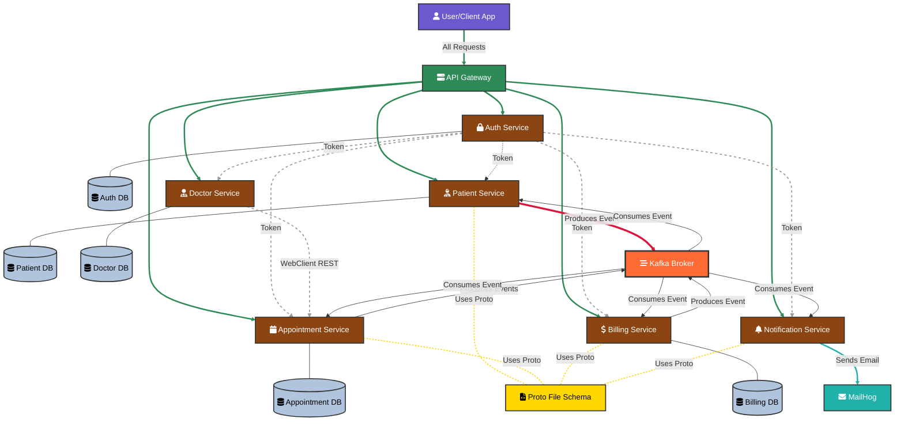

# 🏥 CareBridge - Healthcare Management System

[](https://openjdk.java.net/projects/jdk/17/)
[](https://spring.io/projects/spring-boot)
[](https://www.docker.com/)
[](https://kafka.apache.org/)
[](https://www.postgresql.org/)

A comprehensive **microservices-based healthcare management system** built with modern distributed architecture patterns. CareBridge streamlines healthcare operations through automated appointment booking, patient management, billing processes, and real-time notifications.

## 📊 System Architecture & Data Flow

The following diagram illustrates the complete system architecture, showing how all microservices interact with each other, the API Gateway, databases, and message broker:



### Legend:
- 🟤 **Brown boxes**: Microservices
- 🟢 **Green box**: API Gateway
- 🔵 **Light blue cylinders**: Databases
- 🔴 **Orange box**: Kafka Message Broker
- 🟣 **Purple box**: Client Application
- 🟡 **Gold box**: Protocol Buffers Schema
- 🔵 **Teal box**: MailHog (Email Testing Tool)

---

## 🚀 Key Features

### 🔐 **Authentication & Authorization**
- JWT-based stateless authentication
- Role-based access control (Admin, Patient, Doctor)
- Secure password encryption with BCrypt
- Token validation across all microservices

### 👥 **Patient Management**
- Comprehensive patient profile management
- Admin-controlled patient registration
- Self-registration validation through service integration
- Real-time billing status tracking

### 👨‍⚕️ **Doctor & Appointment Management**
- Dynamic doctor slot generation and management
- Real-time slot availability tracking
- Automated appointment booking with conflict resolution
- Multi-service coordination for booking validation

### 💰 **Billing System**
- Automated billing account creation
- Event-driven bill generation
- Payment processing with transaction tracking
- Real-time status synchronization

### 📧 **Notification Service**
- Automated email notifications for all system events
- MailHog integration for development
- Event-driven notification triggers

### 🌐 **API Gateway**
- Centralized request routing
- Authentication and authorization enforcement
- Cross-cutting concerns handling

## 🛠️ Technology Stack

| Layer | Technologies |
|-------|-------------|
| **Backend** | Java 17, Spring Boot 3.0, Spring Security |
| **Communication** | Spring Cloud Gateway, WebClient, Apache Kafka |
| **Database** | PostgreSQL (separate DB per service) |
| **Security** | JWT, BCrypt Password Encoder |
| **Containerization** | Docker, Docker Compose |
| **Message Broker** | Apache Kafka |
| **Email Service** | MailHog (Development) |

## 🏗️ Microservices Details

### 1. 🔐 Auth Service
**Port**: `8080`  
**Database**: `auth_db`

- **Models**: User (email, password, role, incrementalId)
- **Controllers**: AuthController (login, register, validateToken, getUserById)
- **Services**: 
  - UserService (extends UserDetailsService)
  - AuthService (authenticate, validateToken, registerNewUser)
- **Security**: JwtUtil, JwtAuthFilter, SecurityConfig
- **Integration**: PatientServiceClient (WebClient for patient validation)

### 2. 👥 Patient Service
**Port**: `8081`  
**Database**: `patient_db`

- **Models**: Patient (name, address, dob, registerDate, contact, gender, emergency, billingStatus)
- **Controllers**: PatientController (CRUD operations with role-based access)
- **Features**:
  - Kafka Producer (billing service integration)
  - Kafka Consumer (billing status updates)
  - JWT-based authorization

### 3. 👨‍⚕️ Doctor Service
**Port**: `8082`  
**Database**: `doctor_db`

- **Models**: 
  - Doctor (doctor details)
  - DoctorSlot (doctorId, start, end, isBooked, appointmentDate)
- **Controllers**: DoctorController (doctor and slot management)
- **Features**:
  - Dynamic slot generation
  - Real-time availability tracking
  - WebClient integration with Appointment Service

### 4. 📅 Appointment Service
**Port**: `8083`  
**Database**: `appointment_db`

- **Models**: Appointment (patientId, doctorId, appoDate, status, doctorSlotId)
- **Controllers**: AppointmentController (booking lifecycle management)
- **Features**:
  - Multi-service coordination
  - Protocol Buffers for event messaging
  - Kafka event publishing (billing, notifications)

### 5. 💰 Billing Service
**Port**: `8084`  
**Database**: `billing_db`

- **Models**: 
  - Bill (billingAccountId, appointmentId, patientId, doctorId, issueDate, dueDate, amount, currency, status, paidAt)
  - BillingAccount (patientId, name, email, status, createdAt)
  - PaymentTransaction (billId, billingAccountId, amount, currency, paymentMethod, transactionStatus, gatewayTransactionId, transactionDate)
- **Controllers**: BillingController (billing and payment management)
- **Features**:
  - Event-driven billing generation
  - Kafka integration with Patient and Appointment services

### 6. 📧 Notification Service
**Port**: `8085`  
**Database**: `notification_db`

- **Models**: Notification (email notification details)
- **Features**:
  - MailHog integration
  - Event-driven email triggers
  - Multi-service event consumption

### 7. 🌐 API Gateway
**Port**: `8086`

- **Features**:
  - Centralized routing
  - JWT token validation
  - Request filtering and security

## 📊 Communication Patterns

### Synchronous Communication (WebClient)
- **Auth ↔ Patient**: User registration validation
- **Appointment ↔ Doctor**: Slot availability and booking
- **API Gateway ↔ Auth**: Token validation

### Asynchronous Communication (Kafka)
- **Patient → Billing**: Patient status updates
- **Appointment → Billing**: Billing event generation
- **Appointment → Notification**: Appointment event notifications
- **Billing → Notification**: Payment and billing notifications

## 🗄️ Database Schema

Each microservice maintains its own PostgreSQL database ensuring data isolation and service autonomy:

- `auth_db` - User authentication data
- `patient_db` - Patient profiles and medical information
- `doctor_db` - Doctor profiles and availability slots
- `appointment_db` - Appointment bookings and history
- `billing_db` - Billing accounts, bills, and payment transactions
- `notification_db` - Notification logs and templates

## 🚀 Getting Started

### Prerequisites
- Java 17+
- Docker & Docker Compose
- Maven 3.6+
- PostgreSQL (or Docker)
- Apache Kafka (or Docker)

### 🐳 Running with Docker (Recommended)

1. **Clone the repository**
```bash
git clone https://github.com/1-RoushanKumar/CareBridge-Microservices-Patient-Management-Platform.git
cd carebridge-healthcare-system
```

2. **Start all services**
```bash
docker-compose up -d
```

3. **Verify services are running**
```bash
docker ps
```

### 🔧 Manual Setup

1. **Start PostgreSQL and Kafka**
```bash
# PostgreSQL
docker run --name postgres -e POSTGRES_PASSWORD=password -p 5432:5432 -d postgres

# Kafka
docker run --name kafka -p 9092:9092 -d confluentinc/cp-kafka
```

2. **Build and run each service**
```bash
# Build all services
mvn clean install

# Start services (in order)
java -jar auth-service/target/auth-service-1.0.0.jar
java -jar patient-service/target/patient-service-1.0.0.jar
java -jar doctor-service/target/doctor-service-1.0.0.jar
java -jar appointment-service/target/appointment-service-1.0.0.jar
java -jar billing-service/target/billing-service-1.0.0.jar
java -jar notification-service/target/notification-service-1.0.0.jar
java -jar api-gateway/target/api-gateway-1.0.0.jar
```

## 🔌 API Endpoints

### Authentication Service (Port: 8080)
```
POST   /auth/register          # Register new user
POST   /auth/login             # User login
GET    /auth/validate          # Validate JWT token
GET    /auth/user/{id}         # Get user by ID
```

### Patient Service (Port: 8081)
```
GET    /patients               # Get all patients (Admin only)
GET    /patients/{id}          # Get patient by ID
POST   /patients               # Create patient (Admin only)
PUT    /patients/{id}          # Update patient
DELETE /patients/{id}          # Delete patient
GET    /patients/email/{email} # Get patient by email
```

### Doctor Service (Port: 8082)
```
GET    /doctors                # Get all doctors
GET    /doctors/{id}           # Get doctor by ID
POST   /doctors                # Create doctor
PUT    /doctors/{id}           # Update doctor
DELETE /doctors/{id}           # Delete doctor
POST   /doctors/{id}/slots     # Create slots
GET    /doctors/{id}/slots     # Get available slots
PUT    /doctors/slots/{id}/book # Mark slot as booked
GET    /doctors/{id}/fee       # Get doctor fee
```

### Appointment Service (Port: 8083)
```
POST   /appointments           # Book appointment
PUT    /appointments/{id}/cancel # Cancel appointment
PUT    /appointments/{id}/reschedule # Reschedule appointment
GET    /appointments           # Get all appointments
GET    /appointments/{id}      # Get appointment by ID
PUT    /appointments/{id}/complete # Complete appointment
```

### Billing Service (Port: 8084)
```
GET    /billing/account/{patientId} # Get billing account
GET    /billing/bills/{id}     # Get bill by ID
POST   /billing/bills/{id}/pay # Pay bill
GET    /billing/bills/{id}/payments # Get bill payments
```

## 🔐 Security Implementation

### JWT Token Structure
```json
{
  "sub": "user@example.com",
  "role": "PATIENT",
  "iat": 1640995200,
  "exp": 1640998800
}
```

### Role-Based Access Control
- **ADMIN**: Full system access
- **PATIENT**: Limited to own data and appointments
- **DOCTOR**: Access to assigned appointments and slots

## 📈 Event-Driven Architecture

### Kafka Topics
- `patient-events`: Patient lifecycle events
- `appointment-events`: Appointment booking/cancellation
- `billing-events`: Billing and payment events
- `notification-events`: Email notification triggers

### Event Flow Example (Appointment Booking)
```
1. User books appointment → Appointment Service
2. Appointment Service validates with Doctor Service
3. Slot marked as booked
4. Appointment event published to Kafka
5. Billing Service generates bill
6. Notification Service sends confirmation email
7. Patient Service updates billing status
```

## 🐳 Docker Configuration

### Docker Compose Services
```yaml
services:
  auth-service:
    image: carebridge/auth-service
    ports: ["8080:8080"]
    
  patient-service:
    image: carebridge/patient-service
    ports: ["8081:8081"]
    
  # ... other services
  
  postgres:
    image: postgres:13
    environment:
      POSTGRES_PASSWORD: password
      
  kafka:
    image: confluentinc/cp-kafka
    ports: ["9092:9092"]
```

## 🛣️ Roadmap

### Phase 1 (Completed)
- ✅ Core microservices implementation
- ✅ JWT authentication
- ✅ Event-driven architecture
- ✅ Docker containerization

### Phase 2 (Future Enhancements)
- [ ] Service mesh implementation (Istio)
- [ ] Advanced monitoring (Prometheus/Grafana)
- [ ] CQRS pattern implementation
- [ ] Event sourcing
- [ ] Mobile application
- [ ] Real-time chat functionality

## 👥 Contributing

1. Fork the repository
2. Create a feature branch (`git checkout -b feature/amazing-feature`)
3. Commit your changes (`git commit -m 'Add amazing feature'`)
4. Push to the branch (`git push origin feature/amazing-feature`)
5. Open a Pull Request

## 📝 License

This project is licensed under the MIT License - see the [LICENSE](LICENSE) file for details.

## 📞 Contact

**Your Name** - rk04393@gmail.com  
**LinkedIn** - https://www.linkedin.com/in/roushan-kumar-b2b79b282/  
**Project Link** - https://github.com/1-RoushanKumar/CareBridge-Microservices-Patient-Management-Platform.git

---

## 🏆 Key Achievements

- **Microservices Architecture**: 6 independent, scalable services
- **Security**: Comprehensive JWT-based authentication system
- **Event-Driven Design**: Asynchronous communication for better performance
- **Data Consistency**: Eventual consistency with event sourcing patterns
- **Containerization**: Fully dockerized deployment
- **Real-time Processing**: Kafka-based event streaming
- **RESTful APIs**: 30+ well-documented endpoints
- **Database Per Service**: Complete data isolation and service autonomy

**⭐ Star this repository if you found it helpful!**
